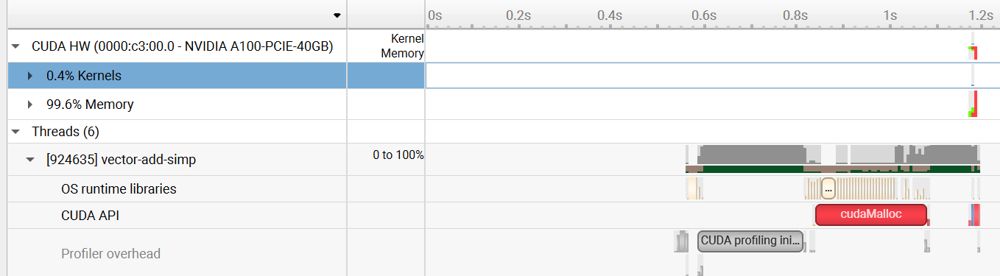
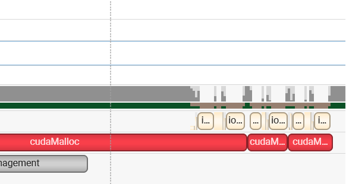

Adding two vectors
=================

What we want to so here is to add two large vectors.
The CPU version is [`cpu.cu`](cpu.cu).

# Naive CUDA C implementation

A naive GPU version is [`simple.cu`](simple.cu).
To check whether [`simple.cu`](simple.cu) runs correctly,
run [`simple-benchmark.sh`](simple-benchmark.sh).
There should be no insistency reported.

To compare the speed of the two programs,
run [`speed-test.sh`](speed-test.sh).
In the result, we see that the GPU version for some reasons is *slower*:
```
Simple GPU implementation

real    0m0.812s
user    0m0.206s
sys     0m0.576s

CPU implementation

real    0m0.009s
user    0m0.004s
sys     0m0.005s
```

Why? Profiling the program by [`simple-profile.sh`](simple-profile.sh),
and load the resulting report into Nsight Systems,
here is what we get:



We find that the first `cudaMalloc` call takes a lot of time.
Zooming in, we find 



So it seems the time cost of the last two `cudaMalloc` calls is normal.
Going to [the documentation](https://docs.nvidia.com/cuda/archive//11.0/pdf/CUDA_C_Programming_Guide.pdf), we find 

>  There is no explicit initialization function for the runtime; it initializes the first time a
 runtime function is called (more specifically any function other than functions from the
 error handling and version management sections of the reference manual). One needs to
 keep this in mind when timing runtime function calls and when interpreting the error
 code from the first call into the runtime.

This behavior is also mentioned in the [forum](https://forums.developer.nvidia.com/t/first-cudamalloc-takes-long-time/4057/3).
The time cost is around 200 ms - as is shown in the first figure.

The second highest type of time cost in [`simple-profile.sh`](simple-profile.sh)
is the initialization process.
If we do not initialize the arrays, the initialization period vanishes,
and the `cudaMalloc` blocks are adjacent to the `cudaMemcpy` blocks.

# Julia CUDA implementation

Julia also has its own CUDA API.
The kernel in [`simple.cu`](simple.cu) is also written in Julia in [`simple.jl`](simple.jl),
and here is the output:
```
(nersc-python) jywu@login30:~/cuda/vector-add> julia simple.jl 
Correctness test
Time cost measured by @btime:
  49.182 μs (23 allocations: 656 bytes)
Time cost measured by @time:
  0.000070 seconds (23 allocations: 656 bytes)
```

For some reasons, currently the time cost of the Julia version is shorter...